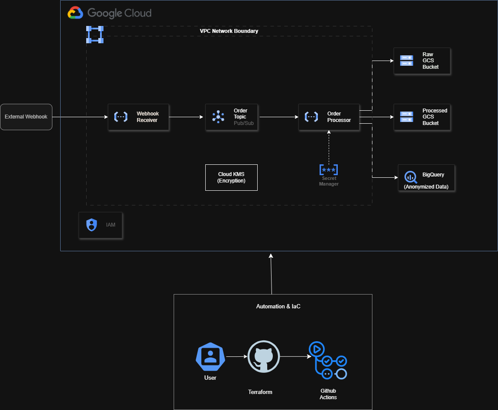
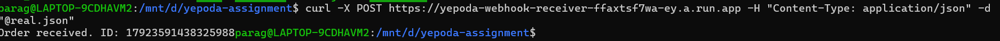
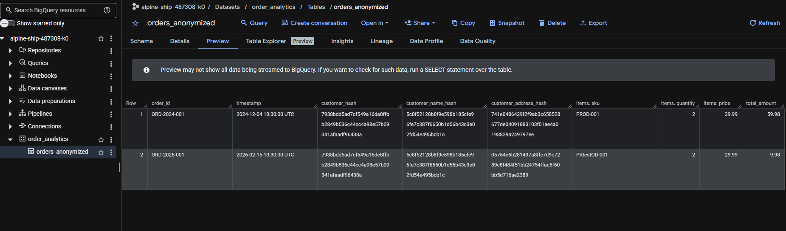

# Data Pipeline: Secure & GDPR-Compliant Event Processing

A robust, serverless data pipeline built on Google Cloud Platform to ingest e-commerce order events, ensuring data privacy through salted PII pseudonymization and enterprise-grade security controls.

## 📐 Architecture

The pipeline follows a cloud-native, event-driven pattern designed for scalability and "Privacy by Design".

### Infrastructure Diagram


### Data Flow
1.  **Ingestion**: An external webhook triggers the **Webhook Receiver** (Cloud Function 2nd Gen).
2.  **Buffering**: Validated events are published to a **Pub/Sub** topic for decoupled processing.
3.  **Processing**: The **Order Processor** (Cloud Function) is triggered natively by Pub/Sub.
4.  **Anonymization**: PII fields (Name, Email, Address) are hashed using **deterministic SHA-256 with a project-specific salt**.
5.  **Storage**: 
    *   **Raw Analytics**: Stored in a GCS bucket with a 7-day retention policy (Audit Layer).
    *   **Processed Analytics**: Resulting anonymized records are streamed into **BigQuery** and archived in a GCS bucket (Cold Storage).

---

## 🛡️ Security & Compliance

This implementation incorporates multiple layers of security to meet the stringent requirements of the enterprise case study:

*   **GDPR Compliance**: Automated pseudonymization of PII before data reaches the analytics layer. Salted hashing ensures one-way transformation while maintaining correlation for analytics.
*   **Infrastructure as Code (IaC)**: 100% of resources managed via Terraform for reproducibility and auditability.
*   **Principle of Least Privilege**: Each serverless component operates under a unique, restricted Service Account.
*   **Encryption at Rest (CMEK)**: All data in GCS, Pub/Sub, and BigQuery is encrypted using **Customer-Managed Encryption Keys (KMS)** with 90-day rotation.
*   **Networking**: Internal communication is secured via **Serverless VPC Access**, ensuring traffic remains within the private network.
*   **Secrets Management**: Sensitive configuration and the PII Salt are managed exclusively through **Google Secret Manager**.

---

## 🚀 Setup & Deployment From Scratch

This guide assumes you are starting with a **clean Google Cloud Project**.

### 1. Prerequisites
Ensure you have the following tools installed:
*   [Google Cloud SDK](https://cloud.google.com/sdk/docs/install)
*   [Terraform](https://developer.hashicorp.com/terraform/downloads) (v1.5+)
*   [Git](https://git-scm.com/downloads)

### 2. Initial Authentication
Before running Terraform, authenticate your CLI:
```bash
gcloud auth login
gcloud auth application-default login
gcloud config set project [YOUR_PROJECT_ID]
```

### 3. Local Configuration
1.  Navigate to the directory: `cd terraform`
2.  Create a `terraform.tfvars` file (this file is gitignored):
    ```hcl
    project_id = "your-project-id"
    region     = "europe-west3"
    ```
3.  **Mandatory Secret**: Set your PII salt as an environment variable:
    ```bash
    # Windows
    $env:TF_VAR_pii_salt_value="your-secret-salt-string"
    # Linux/macOS
    export TF_VAR_pii_salt_value="your-secret-salt-string"
    ```

### 4. Bootstrapping the Infrastructure
Since this project uses a **GCS Backend** for state management, follow these steps for the first run:

1.  **Disable Remote Backend**: In `main.tf`, temporarily comment out the `backend "gcs" { ... }` block (lines 2-5).
2.  **Initialize Locally**: `terraform init`
3.  **Deploy Foundation**: `terraform apply` (This creates the State Bucket, APIs, and Networking).
4.  **Enable Remote Backend**: Uncomment the `backend "gcs"` block in `main.tf`.
5.  **Migrate State**: Run `terraform init` again. Type `yes` when asked to migrate the state to Google Cloud Storage.

### 5. CI/CD Integration (GitHub Actions)
Once the infrastructure is deployed locally, you can enable the automated pipeline:
1.  **Retrieve WIF Provider**: `terraform output wif_provider_name`
2.  **Retrieve Service Account**: `terraform output wif_service_account`
3.  **Add GitHub Secrets**: In your repo settings, add:
    *   `WIF_PROVIDER`: (Output from step 1)
    *   `WIF_SERVICE_ACCOUNT`: (Output from step 2)
    *   `PII_SALT_VALUE`: (Your secret salt string)

---

## 🧹 Professional Decommissioning

Following the **GCP Well-Architected Framework**, there are two professional ways to decommission this environment:

### Option 1: Resource-Level Teardown (Clean Slate)
Use this if you want to keep the GCP project but remove all cost-incurring resources.
1.  **Unlock State**: Migrate the Terraform state from the cloud to your local machine:
    *   Comment out the `backend "gcs"` block in `terraform/main.tf`.
    *   Run `terraform init -migrate-state`.
2.  **Disable Protections**: Set `prevent_destroy = false` in `terraform/storage.tf` and `terraform/modules/networking/main.tf`.
*(Note disable protection (on all resources) is only for local testing, in production it should be enabled)* 
3.  **Execute Destruction**:
    ```bash
    terraform destroy -auto-approve
    ```
4.  **Local Cleanup**: `rm -rf .terraform/ terraform.tfstate*`

### Option 2: Project-Level Termination (Official Recommendation)
The most secure and atomic way to stop all billing and delete all data permanently.
1.  **Identify Project ID**: Find your project ID in the Google Cloud Console.
2.  **Run Deletion**:
    ```bash
    gcloud projects delete [PROJECT_ID]
    ```
    *This action schedules all resources, IAM policies, and data for permanent deletion within 30 days and stops all billing immediately.*

---

## ✅ Verification

### 1. Test the Webhook Endpoint
Retrieve your deployed webhook URL:
```bash
terraform output webhook_uri
```

Send a test order (Windows):
```powershell
curl.exe -X POST https://webhook-receiver-ffaxtsf7wa-ey.a.run.app `
  -H "Content-Type: application/json" `
  -d "@realtime_test.json"
```

Or on Linux/macOS:
```bash
curl -X POST https://webhook-receiver-ffaxtsf7wa-ey.a.run.app -H "Content-Type: application/json" -d "@sample_order.json"
```

**Expected Response:**
```
Order received. ID: 18189746535354365
```

### 2. Verify Data Processing
Check that the order was pseudonymized and stored in BigQuery:
```bash
bq query --use_legacy_sql=false \
  "SELECT order_id, customer_name_hash, order_total 
   FROM \`[PROJECT_ID].order_analytics.orders\` 
   LIMIT 5"
```

You should see hashed values for `customer_name_hash`, `customer_email_hash`, and `shipping_address_hash` instead of plain text PII.

---

## 🔐 Security Auditing (Local)

To maintain the project's security posture, we use a mandatory set of pre-commit hooks that run in the CI/CD pipeline. You can also run these checks locally:

### 1. Manual Security Scan
Ensure you have `pre-commit` installed, then run:
```
 pre-commit run --all-files
```

**Active Security Hooks:**
*   **Gitleaks**: Scans for hardcoded secrets and credentials.
*   **Bandit**: Performs static security analysis on the Python codebase.
*   **Checkov**: Audits Terraform configuration for infrastructure security vulnerabilities and best practices.

---

## 📖 Extended Documentation
*   [GDPR Compliance Strategy](GDPR_COMPLIANCE.md)
*   [Service Selection & Justification](docs/services.md)
*   [Cost Estimation Report](docs/cost_estimation.md)

---

## 📸 Verification & Outputs

### Pipeline Execution Proofs
**Webhook Trigger:**
  
*(Successful reception of sample order payload)*


**BigQuery Analytics Table:**
  
*(Final anonymized record in BigQuery, ready for analysis)*


